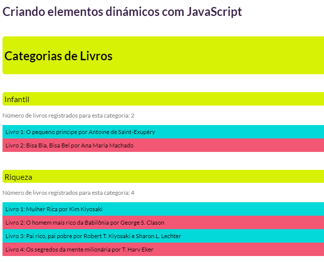

[](https://portfolio-nadi.vercel.app/)
[](https://twitter.com/nadiduno)
[](https://www.linkedin.com/in/nadiduno/)
<br />
<br />
#dynamicElements em JavaScript

Esta aplicação cria as tag´s do HTML usando JavaScript, é dizer mediantes lineas de códigos se criam dinamicamente as tag, dependendo a informação encontrada em um classe.


##Código HTML
```html
<!DOCTYPE html>
<html >
  <body>
    <h1>Criando elementos dinámicos com JavaScript</h1>
    <div id="app"></div>
    <div class="container">
      <div id="category1">
    </div>
  </body>
</html>
```
##Código em JS

##Agregando os objetos de uma classe
```javascript
for (let recorrido of booksByCategory) {
  var divNova = document.createElement('div');
  var conteudoNovo = document.createTextNode(recorrido.category);
  divNova.appendChild(conteudoNovo);
  var divAtual = document.getElementById('category');
  document.body.insertBefore(divNova, divAtual);
 }
```
<div align="center">
  
  <br />
</div>

[Feito com um editor de código Online StackBlitz ⚡️](https://stackblitz.com/edit/js-5bnhej)

Link da aplicação https://js-5bnhej.stackblitz.io/

[DevRel: Nadi Duno - 12/2022 ::heart::](https://www.linkedin.com/in/nadiduno/)
